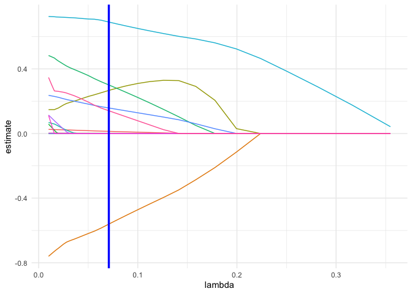
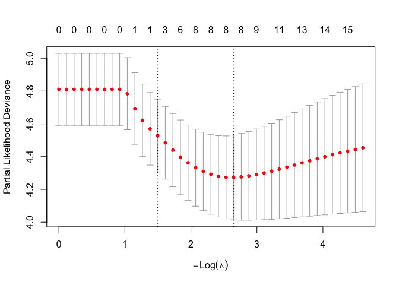

stepwise_cox_cx
================
Chuyuan XU
2025-12-03

# Data Preparation

## Data Wrangling (wenjie, zhaokun)

``` r
# Import data & data cleaning 
cirrhosis <- read.csv("data/cirrhosis.csv") |> clean_names()

# Status convert to event indicator (1 = death, 0 = censored)
cirrhosis <- cirrhosis |>
  mutate(
    event = case_when(
      status == "D" ~ 1,
      status %in% c("C", "CL") ~ 0,
      TRUE ~ NA_real_
    ),
    sex = factor(sex),
    drug = factor(drug),
    ascites = factor(ascites),
    hepatomegaly = factor(hepatomegaly),
    spiders = factor(spiders),
    edema = factor(edema, levels = c("N", "S", "Y"), ordered = TRUE),
    stage = factor(stage) # Yixin: "Stage: histologic stage of disease (1, 2, 3, or 4)"
  )

cirrhosis <- cirrhosis |>
  mutate(age_years = age / 365.25)
```

``` r
# drop variables not needed in the following modeling
cirrhosis_df = cirrhosis |>
  mutate(
    # log_transformed bilirubin
    log_bilirubin = log(bilirubin),
    
    # edema group "S" "Y" combined
    edema_bin = case_when(
      edema == "N" ~ 0L,                  
      edema %in% c("S", "Y") ~ 1L,       
      TRUE ~ NA_integer_
    ),
  ) |>
  dplyr::select(-id, -status, -age, -tryglicerides, -cholesterol, -bilirubin, -edema) |>
  na.omit()
```

All rows with NA omitted for Stepwise and LASSO Cox model selection.
Log-transformed `Bilirubin` is included in the Cox model. `Edama`
derives a binary variable `Edema_bin` based on the presence or absence
of Edema.

### Stepwise Cox

``` r
sw_full = coxph(
  Surv(n_days, event) ~ 
    drug + 
    sex + ascites + hepatomegaly + 
    spiders + edema_bin + albumin + 
    copper + alk_phos + sgot + 
    platelets + prothrombin + stage + 
    age_years + log_bilirubin,
  data = cirrhosis_df)

sw_null = coxph(
  Surv(n_days, event) ~ 
    1, 
  data = cirrhosis_df)

step_cox = MASS::stepAIC(sw_full, direction = "both", na.rm = TRUE)
```

    ## Start:  AIC=1080.53
    ## Surv(n_days, event) ~ drug + sex + ascites + hepatomegaly + spiders + 
    ##     edema_bin + albumin + copper + alk_phos + sgot + platelets + 
    ##     prothrombin + stage + age_years + log_bilirubin
    ## 
    ##                 Df    AIC
    ## - platelets      1 1078.5
    ## - spiders        1 1078.6
    ## - hepatomegaly   1 1078.6
    ## - ascites        1 1078.7
    ## - drug           1 1078.8
    ## - sex            1 1079.0
    ## - alk_phos       1 1079.2
    ## - stage          3 1079.5
    ## - sgot           1 1080.4
    ## <none>             1080.5
    ## - copper         1 1080.7
    ## - edema_bin      1 1082.5
    ## - age_years      1 1085.3
    ## - prothrombin    1 1086.1
    ## - albumin        1 1086.5
    ## - log_bilirubin  1 1107.1
    ## 
    ## Step:  AIC=1078.53
    ## Surv(n_days, event) ~ drug + sex + ascites + hepatomegaly + spiders + 
    ##     edema_bin + albumin + copper + alk_phos + sgot + prothrombin + 
    ##     stage + age_years + log_bilirubin
    ## 
    ##                 Df    AIC
    ## - spiders        1 1076.6
    ## - hepatomegaly   1 1076.6
    ## - ascites        1 1076.7
    ## - drug           1 1076.8
    ## - sex            1 1077.0
    ## - alk_phos       1 1077.2
    ## - stage          3 1077.6
    ## <none>             1078.5
    ## - sgot           1 1078.6
    ## - copper         1 1078.7
    ## + platelets      1 1080.5
    ## - edema_bin      1 1080.8
    ## - age_years      1 1083.3
    ## - prothrombin    1 1084.2
    ## - albumin        1 1084.5
    ## - log_bilirubin  1 1106.1
    ## 
    ## Step:  AIC=1076.56
    ## Surv(n_days, event) ~ drug + sex + ascites + hepatomegaly + edema_bin + 
    ##     albumin + copper + alk_phos + sgot + prothrombin + stage + 
    ##     age_years + log_bilirubin
    ## 
    ##                 Df    AIC
    ## - hepatomegaly   1 1074.6
    ## - ascites        1 1074.7
    ## - drug           1 1074.9
    ## - sex            1 1075.1
    ## - alk_phos       1 1075.2
    ## - stage          3 1075.6
    ## <none>             1076.6
    ## - copper         1 1076.7
    ## - sgot           1 1076.7
    ## + spiders        1 1078.5
    ## + platelets      1 1078.6
    ## - edema_bin      1 1078.8
    ## - age_years      1 1081.5
    ## - prothrombin    1 1082.2
    ## - albumin        1 1082.5
    ## - log_bilirubin  1 1104.9
    ## 
    ## Step:  AIC=1074.6
    ## Surv(n_days, event) ~ drug + sex + ascites + edema_bin + albumin + 
    ##     copper + alk_phos + sgot + prothrombin + stage + age_years + 
    ##     log_bilirubin
    ## 
    ##                 Df    AIC
    ## - ascites        1 1072.7
    ## - drug           1 1072.9
    ## - sex            1 1073.2
    ## - alk_phos       1 1073.3
    ## - stage          3 1074.5
    ## <none>             1074.6
    ## - copper         1 1074.7
    ## - sgot           1 1074.7
    ## + hepatomegaly   1 1076.6
    ## + spiders        1 1076.6
    ## + platelets      1 1076.6
    ## - edema_bin      1 1076.9
    ## - age_years      1 1079.5
    ## - prothrombin    1 1080.3
    ## - albumin        1 1080.7
    ## - log_bilirubin  1 1105.6
    ## 
    ## Step:  AIC=1072.74
    ## Surv(n_days, event) ~ drug + sex + edema_bin + albumin + copper + 
    ##     alk_phos + sgot + prothrombin + stage + age_years + log_bilirubin
    ## 
    ##                 Df    AIC
    ## - drug           1 1071.0
    ## - sex            1 1071.4
    ## - alk_phos       1 1071.6
    ## - stage          3 1072.7
    ## <none>             1072.7
    ## - sgot           1 1072.8
    ## - copper         1 1073.4
    ## + ascites        1 1074.6
    ## + spiders        1 1074.7
    ## + hepatomegaly   1 1074.7
    ## + platelets      1 1074.7
    ## - edema_bin      1 1075.2
    ## - age_years      1 1077.8
    ## - prothrombin    1 1078.6
    ## - albumin        1 1080.9
    ## - log_bilirubin  1 1104.8
    ## 
    ## Step:  AIC=1071.03
    ## Surv(n_days, event) ~ sex + edema_bin + albumin + copper + alk_phos + 
    ##     sgot + prothrombin + stage + age_years + log_bilirubin
    ## 
    ##                 Df    AIC
    ## - sex            1 1069.6
    ## - alk_phos       1 1069.9
    ## <none>             1071.0
    ## - stage          3 1071.1
    ## - sgot           1 1071.1
    ## - copper         1 1071.8
    ## + drug           1 1072.7
    ## + ascites        1 1072.9
    ## + spiders        1 1073.0
    ## + hepatomegaly   1 1073.0
    ## + platelets      1 1073.0
    ## - edema_bin      1 1073.3
    ## - age_years      1 1075.8
    ## - prothrombin    1 1077.1
    ## - albumin        1 1079.0
    ## - log_bilirubin  1 1102.8
    ## 
    ## Step:  AIC=1069.63
    ## Surv(n_days, event) ~ edema_bin + albumin + copper + alk_phos + 
    ##     sgot + prothrombin + stage + age_years + log_bilirubin
    ## 
    ##                 Df    AIC
    ## - alk_phos       1 1068.6
    ## - stage          3 1069.5
    ## <none>             1069.6
    ## - sgot           1 1069.9
    ## + sex            1 1071.0
    ## + drug           1 1071.4
    ## - edema_bin      1 1071.5
    ## + ascites        1 1071.5
    ## + spiders        1 1071.5
    ## + hepatomegaly   1 1071.6
    ## + platelets      1 1071.6
    ## - copper         1 1072.1
    ## - prothrombin    1 1075.5
    ## - age_years      1 1076.6
    ## - albumin        1 1077.2
    ## - log_bilirubin  1 1101.0
    ## 
    ## Step:  AIC=1068.62
    ## Surv(n_days, event) ~ edema_bin + albumin + copper + sgot + prothrombin + 
    ##     stage + age_years + log_bilirubin
    ## 
    ##                 Df    AIC
    ## <none>             1068.6
    ## - stage          3 1068.9
    ## - sgot           1 1069.2
    ## + alk_phos       1 1069.6
    ## + sex            1 1069.9
    ## + drug           1 1070.3
    ## + ascites        1 1070.3
    ## - copper         1 1070.3
    ## + platelets      1 1070.5
    ## + hepatomegaly   1 1070.6
    ## + spiders        1 1070.6
    ## - edema_bin      1 1070.7
    ## - prothrombin    1 1074.0
    ## - albumin        1 1075.3
    ## - age_years      1 1077.1
    ## - log_bilirubin  1 1100.0

``` r
summary(step_cox)
```

    ## Call:
    ## coxph(formula = Surv(n_days, event) ~ edema_bin + albumin + copper + 
    ##     sgot + prothrombin + stage + age_years + log_bilirubin, data = cirrhosis_df)
    ## 
    ##   n= 306, number of events= 123 
    ## 
    ##                    coef exp(coef)  se(coef)      z Pr(>|z|)    
    ## edema_bin      0.475799  1.609300  0.231235  2.058  0.03962 *  
    ## albumin       -0.763456  0.466053  0.255175 -2.992  0.00277 ** 
    ## copper         0.002001  1.002003  0.001003  1.995  0.04604 *  
    ## sgot           0.002830  1.002834  0.001722  1.644  0.10020    
    ## prothrombin    0.288718  1.334715  0.102905  2.806  0.00502 ** 
    ## stage2         1.346436  3.843701  1.060913  1.269  0.20440    
    ## stage3         1.478849  4.387893  1.034096  1.430  0.15269    
    ## stage4         1.762568  5.827381  1.032820  1.707  0.08790 .  
    ## age_years      0.029909  1.030361  0.009256  3.231  0.00123 ** 
    ## log_bilirubin  0.715298  2.044795  0.121071  5.908 3.46e-09 ***
    ## ---
    ## Signif. codes:  0 '***' 0.001 '**' 0.01 '*' 0.05 '.' 0.1 ' ' 1
    ## 
    ##               exp(coef) exp(-coef) lower .95 upper .95
    ## edema_bin        1.6093     0.6214    1.0228    2.5320
    ## albumin          0.4661     2.1457    0.2826    0.7685
    ## copper           1.0020     0.9980    1.0000    1.0040
    ## sgot             1.0028     0.9972    0.9995    1.0062
    ## prothrombin      1.3347     0.7492    1.0909    1.6330
    ## stage2           3.8437     0.2602    0.4805   30.7468
    ## stage3           4.3879     0.2279    0.5781   33.3027
    ## stage4           5.8274     0.1716    0.7697   44.1176
    ## age_years        1.0304     0.9705    1.0118    1.0492
    ## log_bilirubin    2.0448     0.4890    1.6129    2.5924
    ## 
    ## Concordance= 0.858  (se = 0.018 )
    ## Likelihood ratio test= 204.6  on 10 df,   p=<2e-16
    ## Wald test            = 195.2  on 10 df,   p=<2e-16
    ## Score (logrank) test = 254.9  on 10 df,   p=<2e-16

``` r
sw.cox_coef = step_cox |>
  broom::tidy() |>
  mutate(
    astrid = case_when(
      p.value < 0.001 ~ "***",
      p.value >= 0.001 & p.value <= 0.01 ~ "**",
      p.value >= 0.01 & p.value <= 0.05 ~ "*",
      TRUE ~ ""
    )
  )

sw.cox_coef |>
  knitr::kable(
    digits = 3,
    col.names = c("term", "estimate", "std.error", "statistic", "p.value", ""),
    caption = "Stepwise Cox Proportional Hazard Regression Model -- coefficients"
  )
```

| term          | estimate | std.error | statistic | p.value |        |
|:--------------|---------:|----------:|----------:|--------:|:-------|
| edema_bin     |    0.476 |     0.231 |     2.058 |   0.040 | \*     |
| albumin       |   -0.763 |     0.255 |    -2.992 |   0.003 | \*\*   |
| copper        |    0.002 |     0.001 |     1.995 |   0.046 | \*     |
| sgot          |    0.003 |     0.002 |     1.644 |   0.100 |        |
| prothrombin   |    0.289 |     0.103 |     2.806 |   0.005 | \*\*   |
| stage2        |    1.346 |     1.061 |     1.269 |   0.204 |        |
| stage3        |    1.479 |     1.034 |     1.430 |   0.153 |        |
| stage4        |    1.763 |     1.033 |     1.707 |   0.088 |        |
| age_years     |    0.030 |     0.009 |     3.231 |   0.001 | \*\*   |
| log_bilirubin |    0.715 |     0.121 |     5.908 |   0.000 | \*\*\* |

Stepwise Cox Proportional Hazard Regression Model – coefficients

``` r
sw.cox_test = step_cox |>
  broom::glance() |>
  select(
    n, nevent, statistic.wald, p.value.wald, logLik, AIC, BIC,
  ) 

sw.cox_test |>
  knitr::kable(
    digits = 3,
    caption = "Stepwise Cox Proportional Hazard Regression Model -- Global Tests Results"
  )
```

|   n | nevent | statistic.wald | p.value.wald |   logLik |      AIC |      BIC |
|----:|-------:|---------------:|-------------:|---------:|---------:|---------:|
| 306 |    123 |         195.21 |            0 | -524.311 | 1068.622 | 1096.744 |

Stepwise Cox Proportional Hazard Regression Model – Global Tests Results

``` r
write.xlsx(
  list(
      coefficient = sw.cox_coef,
      tests = sw.cox_test
  ),
  file = "table_output/stepwise_cox.xlsx"
)
```

A Stepwise Cox Proportional Hazard regression was performed to identify
the most parsimonious model that estimates subjects’ hazard of
Cirrhosis. The model selection was based on Akaike’s Information
Criterion (AIC). The final model achieved the lowest AIC of 1068.622,
including the variables of Edema Presence, Albumin(mg/dl), Urine
copper(ug/day), SGOT (U/ml), Prothrombin time (s), histologic stage of
disease, age (years) and log-transformed serum Bilirubin (mg/dl) as
predictors. Several variables showed significant associations (p \<
0.05) with the hazard function, while disease stages (all p-values\>
0.05) and SGOT (p-value \> 0.01) are weaker contributors to the model.
The overall model shows significant discriminatory ability over
subjects’ hazards with a concordance of 0.858. Global tests show the
model has a good fit (Wald test, p \<2e-16).

The final model from stepwise selection further supported the results
from the above data Cox ph model that drug is an insignificant
predictor. Urine copper and SGOT, in addition, were kept in the stepwise
Cox model, but were removed in the final proposed model.

### Lasso Cox

``` r
set.seed(1234)
x = model.matrix(
    ~ drug + 
      sex + ascites + hepatomegaly + 
      spiders + edema_bin + albumin + 
      copper + alk_phos + sgot + 
      platelets + prothrombin + stage + 
      age_years + log_bilirubin - n_days - event, 
    data = cirrhosis_df)[, -1]

y = Surv(cirrhosis_df$n_days, cirrhosis_df$event)

lambda = 10^(seq(-2, 0, 0.05))

lasso_fit =
  glmnet(x, y, family = "cox", lambda = lambda)

lasso_cv =
  cv.glmnet(x, y, family = "cox", lambda = lambda, alpha = 1)

lambda_opt = lasso_cv[["lambda.min"]]
lambda_1se = lasso_cv[["lambda.1se"]]

lasso_plot1 = lasso_fit |> 
  broom::tidy() |> 
  select(term, lambda, estimate) |> 
  complete(term, lambda, fill = list(estimate = 0) ) |> 
  filter(term != "(Intercept)") |> 
  ggplot(aes(x = lambda, y = estimate, group = term, color = term)) + 
  geom_path() + 
  geom_vline(xintercept = lambda_opt, color = "blue", size = 1.2) +
  theme_minimal() + 
  theme(legend.position = "none")
```

    ## Warning: Using `size` aesthetic for lines was deprecated in ggplot2 3.4.0.
    ## ℹ Please use `linewidth` instead.
    ## This warning is displayed once every 8 hours.
    ## Call `lifecycle::last_lifecycle_warnings()` to see where this warning was
    ## generated.

``` r
lasso_plot1
```

<!-- -->

``` r
plot(lasso_cv)
```

<!-- -->

``` r
coef_lasso_opt = coef(lasso_cv, s = "lambda.min")
lasso_opt = data.frame(term = rownames(coef_lasso_opt), estimate_opt = as.numeric(coef_lasso_opt)) |>
  mutate(
    estimate_opt = case_when(
      estimate_opt == 0 ~ "-",
      TRUE ~ as.character(round(estimate_opt, 3))
    )
  )

coef_lasso_1se = coef(lasso_cv, s = "lambda.1se")
lasso_1se = data.frame(term = rownames(coef_lasso_1se), estimate_1se = as.numeric(coef_lasso_1se)) |>
  mutate(
    estimate_1se = case_when(
      estimate_1se == 0 ~ "-",
      TRUE ~ as.character(round(estimate_1se, 3))
    )
  )

lasso.cox = left_join(lasso_opt, lasso_1se, by = "term")

lasso.cox |>
  knitr::kable()
```

| term          | estimate_opt | estimate_1se |
|:--------------|:-------------|:-------------|
| drugPlacebo   | \-           | \-           |
| sexM          | \-           | \-           |
| ascitesY      | 0.267        | \-           |
| hepatomegalyY | \-           | \-           |
| spidersY      | \-           | \-           |
| edema_bin     | 0.301        | \-           |
| albumin       | -0.561       | \-           |
| copper        | 0.002        | \-           |
| alk_phos      | \-           | \-           |
| sgot          | \-           | \-           |
| platelets     | \-           | \-           |
| prothrombin   | 0.158        | \-           |
| stage2        | \-           | \-           |
| stage3        | \-           | \-           |
| stage4        | 0.141        | \-           |
| age_years     | 0.013        | \-           |
| log_bilirubin | 0.69         | 0.464        |

``` r
write.xlsx(
  lasso.cox,
  file = "table_output/lasso_cox.xlsx"
) 
```

Another Lasso Cox Proportional Hazard regression was performed to
identify the most parsimonious model that estimates subjects’ hazard of
Cirrhosis. The model selection was based on the Penalty Parameter,
lambda. The final model achieved the penalty parameter of 0.071,
including the variables of Ascites Presence, Edema Presence,
Albumin(mg/dl), Urine copper(ug/day), Prothrombin time (s), histologic
stage 4 of disease, age (years) and log-transformed serum Bilirubin
(mg/dl) as predictors. Another simpler model was provided with the
log-transformed serum Bilirubin (mg/dl) as the only predictor, where
allows the largest penalty parameter at which the MSE is within one
standard error of the smallest MSE, which is 0.224. The model with the
smallest penalty parameter was considered due to its better performance
in estimation.

The final model from Lasso selection further supported the results from
the above data Cox Proportional Hazard model that drug is an
insignificant predictor. Ascites Presence and Urine copper, in addition,
was kept in the Lasso Cox model, but was removed in the final proposed
model.

### Nomgram

``` r
# final model (Zhaokun)
dd <- datadist(cirrhosis_df)
options(datadist = "dd")

fit_nomo <- cph(
  Surv(n_days, event) ~
    drug +                # treatment: D-pen vs placebo
    age_years +           # age in years
    log_bilirubin +       # log-transformed bilirubin
    albumin +             # serum albumin
    prothrombin +         # prothrombin time
    edema_bin +           # edema: 0 = none, 1 = S/Y
    stage,                # histologic stage as stratification factor
  data = cirrhosis_df,
  x = TRUE, y = TRUE, surv = TRUE)

sf = Survival(fit_nomo)

# survival time for 1 year, 3 year and 5 year
surv_1y  <- function(lp) sf(365,  lp)
surv_3y  <- function(lp) sf(1095, lp)
surv_5y  <- function(lp) sf(1825, lp)

nomo <- nomogram(
  fit_nomo, 
  fun = list(
    "1-year Survival" = surv_1y,
    "3-year Survival" = surv_3y,
    "5-year Survival" = surv_5y
    ),
  funlabel = c("1-year Survival", "3-year Survival", "5-year Survival")
  )


plot(
  nomo,
  xfrac = 0.4,         # More room for labels
  lmgp = 0.5,          # left margin for variable names
  tcl = -0.5,          # Tick length
  cex.var = 0.8,       # variable label size
  cex.axis = 0.5,      # axis label size
  cex.points = 1.2,    # Points scale
  label.every = 2,     # Spread axis tick labels
  fun.spacing = 1.8,   # vertical spacing
  col.grid = "gray80",
)

title(
  main ="Nomogram for Cirrhosis Survival",
  sub = "1-, 3-, and 5-year survival predictions"
)
```

<!-- -->

The figure above is the nomogram generated to estimate the patients 1-,
3- and 5- year with predictors from the final Cox ph model. The nomogram
produces similar results where treatment types are no strong predictors
in the model.
